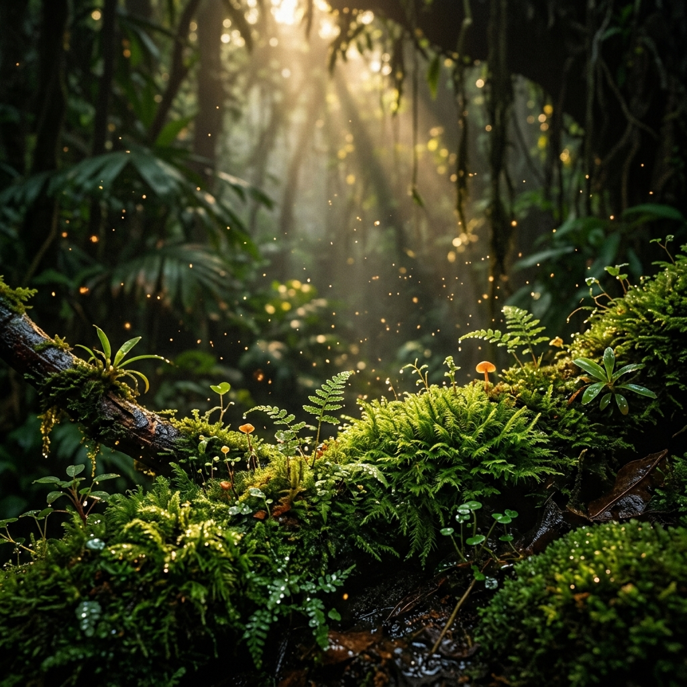

# 🌿 HydroCrops

> AI-powered hydroponic plant disease detection and monitoring dashboard



---

## 📖 Overview

**HydroCrops** is a full-stack web application that uses machine learning to detect nutrient deficiencies and diseases in hydroponic plants from leaf images. It provides a complete pipeline — from image upload and AI classification to dataset management, feature analysis, and treatment recommendations.

---

## ✨ Features

| Feature | Description |
|---|---|
| 🔍 **Image Diagnostics** | Upload a plant leaf image and get an AI-powered diagnosis with confidence scores |
| 🧠 **Plant Classifier** | Multi-class disease classifier (Healthy, Nitrogen, Potassium, Phosphorus deficiency) |
| 📊 **Dataset Dashboard** | Browse, filter, and manage the full plant image dataset |
| 📈 **Feature Analysis** | Visualize color histograms, texture metrics, and statistical feature distributions |
| 🤖 **Model Prediction** | Real-time model predictions with probability breakdowns |
| 📦 **Batch Training** | Batch process and train on multiple images at once |
| 💊 **Treatment Protocol** | AI-generated immediate measures and long-term prevention recommendations |
| 🌱 **Data Analysis** | Summary statistics, class distributions, and health trends |

---

## 🛠️ Tech Stack

### Frontend
- **React 19** + **TypeScript**
- **Vite** — lightning-fast build tool
- **TailwindCSS v4** — utility-first styling
- **Radix UI** — accessible headless component primitives
- **Recharts** — data visualization
- **TanStack Query** — server state management
- **Wouter** — lightweight client-side routing
- **Lucide React** — icon library

### Backend
- **Express.js** — REST API server
- **TypeScript** + **tsx** — server-side execution
- **Drizzle ORM** + **Neon (PostgreSQL)** — database layer
- **Zod** — schema validation
- **Passport.js** — authentication

### AI / ML
- Custom hydroponic plant disease classifier
- Color channel feature extraction (R, G, B mean/std)
- Texture and morphology analysis
- Multi-class classification: **Healthy**, **Nitrogen**, **Potassium**, **Phosphorus**

---

## 🚀 Getting Started

### Prerequisites
- **Node.js** v20+
- **npm** v10+

### Installation

```bash
# Clone the repository
git clone https://github.com/justdarshan510/Hydrocrops.git
cd Hydrocrops

# Install dependencies
npm install
```

### Development

```bash
npm run dev
```

The app will start at **http://localhost:5000**

### Production Build

```bash
npm run build
npm start
```

---

## 📁 Project Structure

```
hydrocrops/
├── client/                  # React frontend
│   ├── public/              # Static assets (background images)
│   └── src/
│       ├── components/      # All page components
│       │   ├── LandingPage.tsx        # Animated landing page
│       │   ├── ClassifierHome.tsx     # Main classifier UI
│       │   ├── ImageDiagnostics.tsx   # Image upload & diagnosis
│       │   ├── DatasetDashboard.tsx   # Dataset browser
│       │   ├── FeatureAnalysis.tsx    # ML feature visualizations
│       │   ├── ModelPrediction.tsx    # Prediction interface
│       │   ├── BatchImageTraining.tsx # Batch processing
│       │   ├── DataAnalysis.tsx       # Data statistics
│       │   └── Sidebar.tsx            # Navigation sidebar
│       ├── lib/             # Utilities & mock data
│       └── pages/           # Route-level pages
├── server/                  # Express backend
│   ├── routes.ts            # API route definitions
│   ├── storage.ts           # Data access layer
│   └── app.ts               # Express app setup
├── shared/                  # Shared types & schema
├── plant-health/            # Plant image dataset
│   ├── healthy/             # Healthy plant images
│   └── unhealthy/           # Deficiency images (N, K, P)
└── healthy dataset.csv      # Dataset metadata CSV
```

---

## 🌿 Disease Classes

| Class | Description | Symptoms |
|---|---|---|
| ✅ **Healthy** | Normal plant growth | Vibrant green leaves, normal morphology |
| 🟡 **Nitrogen (N)** | Nitrogen deficiency | Yellowing of older leaves, pale green color |
| 🟠 **Potassium (K)** | Potassium deficiency | Brown leaf edges, scorched tips |
| 🔵 **Phosphorus (P)** | Phosphorus deficiency | Purple/dark green discoloration |

---

## 🖼️ Screenshots

### Landing Page
Cinematic rainforest background with animated leaf sway and floating particles.

### Classifier Dashboard
Upload a plant image → get instant AI diagnosis with confidence scores, feature breakdown, and treatment protocol.

---

## 📜 Scripts

| Command | Description |
|---|---|
| `npm run dev` | Start development server (port 5000) |
| `npm run build` | Build for production |
| `npm start` | Run production build |
| `npm run check` | TypeScript type-check |
| `npm run db:push` | Push Drizzle ORM schema to database |

---

## 📄 License

MIT © [justdarshan510](https://github.com/justdarshan510)

---

<div align="center">
  Made with 💚 for smarter hydroponic farming
</div>
